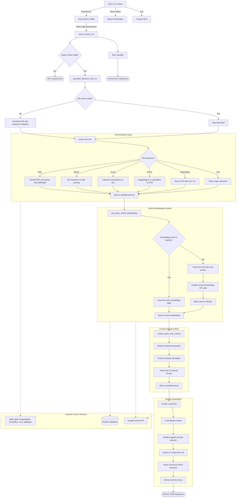

# Detailed mermaid diagram 

```mermaid
flowchart TD
    %% Entry Point
    A[main.rs CLI Menu] -->|Start Server| B[Axum Server :8000]
    A -->|Show Status| A2[Status Placeholder]
    A -->|Exit| A3[Program Exit]

    %% Server Request Handler
    B -->|POST /api/v1/hackrx/run| C[server::hackrx_run]
    C --> C1{Bearer Token Valid?}
    C1 -->|No| E401([401 Unauthorized])
    C1 -->|Yes| C2[generate_filename_from_url]

    %% Document Processing Pipeline
    C2 --> D1{File exists locally?}
    D1 -->|No| D2[download_file with extension validation]
    D1 -->|Yes| D3[Skip download]
    D2 --> D4[extract_file_text]
    D3 --> D4

    %% Multi-Format Text Extraction
    subgraph Extraction [Text Extraction Layer]
        D4 --> EXT1{File Extension?}
        EXT1 -->|PDF| EXT_PDF[Parallel PDF processing with pdftk/qpdf]
        EXT1 -->|DOCX| EXT_DOCX[ZIP extraction to XML parsing]
        EXT1 -->|XLSX| EXT_XLSX[Calamine spreadsheet to text]
        EXT1 -->|PPTX| EXT_PPTX[ImageMagick or LibreOffice to OCR]
        EXT1 -->|PNG/JPEG| EXT_IMG[Direct OCR with ocrs CLI]
        EXT1 -->|TXT| EXT_TXT[Token regex extraction]
        
        EXT_PDF --> TXT_OUT[Save to pdfs/filename.txt]
        EXT_DOCX --> TXT_OUT
        EXT_XLSX --> TXT_OUT
        EXT_PPTX --> TXT_OUT
        EXT_IMG --> TXT_OUT
        EXT_TXT --> TXT_OUT
    end

    %% Embeddings and Vector Storage
    TXT_OUT --> EMB_START[get_policy_chunk_embeddings]
    
    subgraph Embeddings [Vector Embeddings System]
        EMB_START --> EMB1{Embeddings exist in MySQL?}
        EMB1 -->|Yes| EMB_LOAD[Load from pdf_embeddings table]
        EMB1 -->|No| EMB_CHUNK[Chunk text into 33k char pieces]
        EMB_CHUNK --> EMB_API[Parallel Gemini Embedding API calls]
        EMB_API --> EMB_STORE[Batch store to MySQL]
        EMB_LOAD --> EMB_RETURN[Return chunk embeddings]
        EMB_STORE --> EMB_RETURN
    end

    %% Context-Aware Retrieval
    EMB_RETURN --> CTX_START[rewrite_policy_with_context]
    
    subgraph Context_RAG [Context Selection RAG]
        CTX_START --> CTX1[Embed combined questions]
        CTX1 --> CTX2[Cosine similarity calculation]
        CTX2 --> CTX3[Select top 10 relevant chunks]
        CTX3 --> CTX4[Write contextfiltered.txt]
    end

    %% Answer Generation
    CTX4 --> ANS_START[answer_questions]
    
    subgraph Answer_Gen [Answer Generation]
        ANS_START --> ANS1[Load filtered context]
        ANS1 --> ANS2[Sanitize against prompt injection]
        ANS2 --> ANS3[Gemini 2.0 Flash API call]
        ANS3 --> ANS4[Parse structured JSON response]
        ANS4 --> ANS_END[Extract answers array]
    end

    %% Final Response
    ANS_END --> SUCCESS([200 OK JSON Response])
    
    %% Error Handling
    C --> ERR_HANDLER[Error Handler]
    ERR_HANDLER --> ERR_RESPONSE([4xx/5xx Error Response])

    %% External Dependencies
    subgraph External [External Tools & Services]
        EXT_TOOLS[pdftk, qpdf, ImageMagick, LibreOffice, ocrs, pdftoppm]
        MYSQL_DB[(MySQL Database)]
        GEMINI_API[Google Gemini API]
    end
    
    Extraction -.-> EXT_TOOLS
    Embeddings -.-> MYSQL_DB
    Embeddings -.-> GEMINI_API
    Answer_Gen -.-> GEMINI_API
```